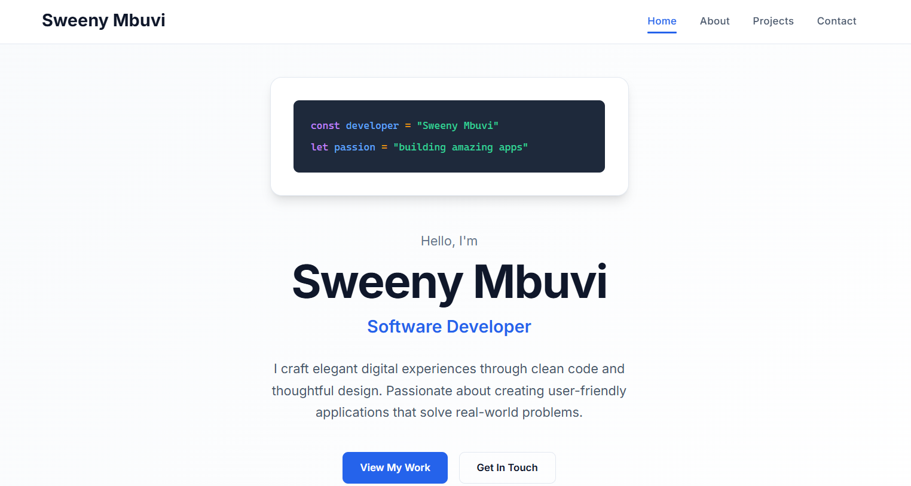
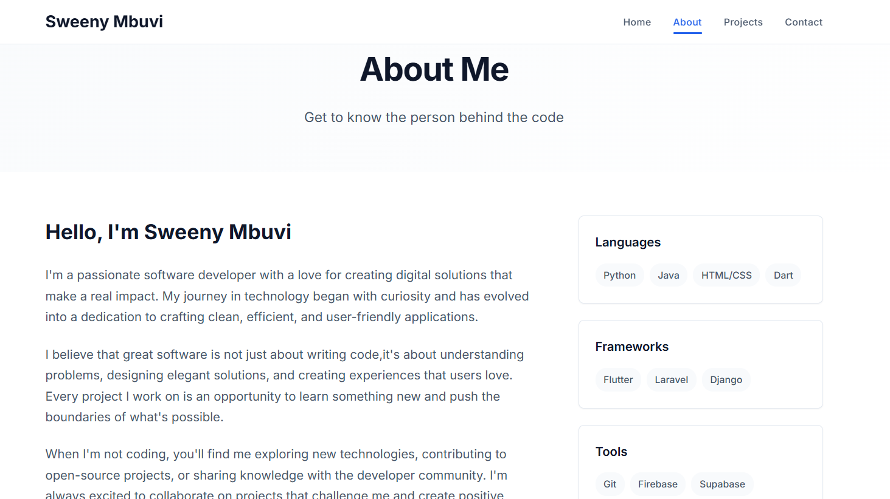
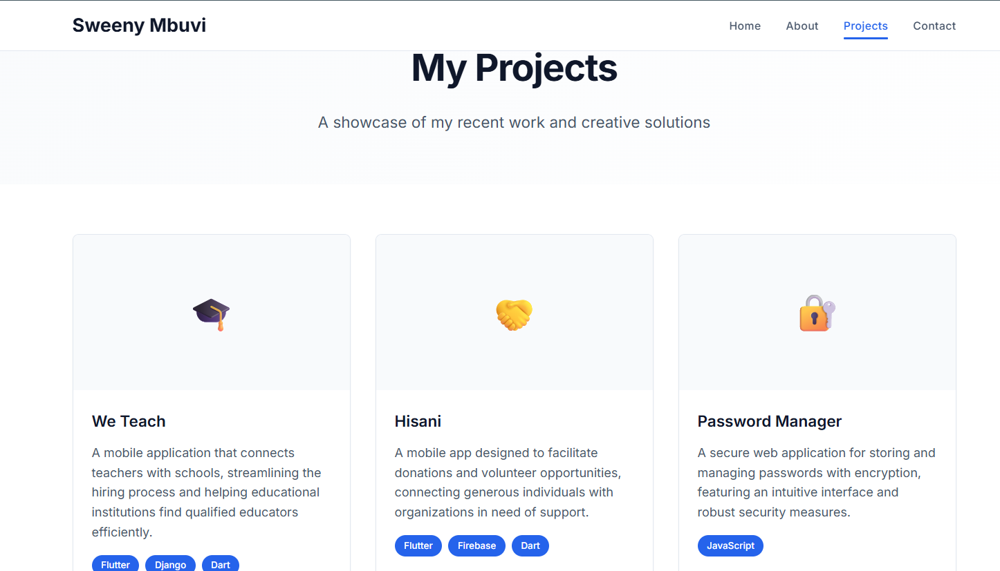
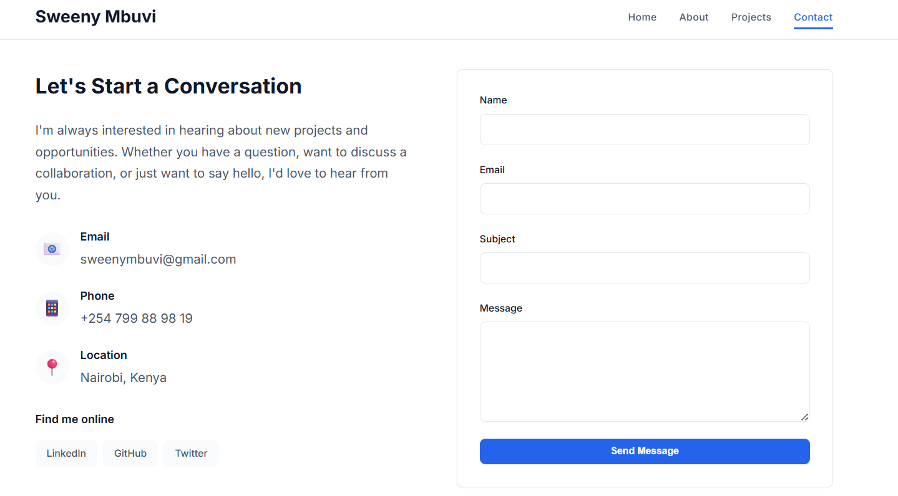

# Sweeny Mbuvi's Portfolio

## Project Title
My Personal GitHub Portfolio Project

## 🎯 Project Overview
This portfolio website showcases my skills as a software developer with a clean, modern design and responsive layouts across all devices.

**Live Site:** https://sweenymbuvi.github.io/portfolio-sweenymbuvi/

## Screenshots

## 🔧 What I Learned

### Technical Skills
- **HTML5:** Semantic structure, proper meta tags, accessibility
- **CSS:** Flexbox, Grid, responsive design, animations
- **Git/GitHub:** Version control and project management

## 📈 Achievements
- Fully responsive portfolio website
- Clean, maintainable code structure
- Professional presentation of projects
- Optimized performance across devices

